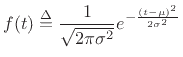

# Naive-Bayes-Algorithm-from-Scratch

Naive bayes algorithm is a superwise Machine learning algorithm based on the BAYES THEOREM and is used for classfication. It uses the concept of Guassian Probability density function for finding the probability of class when target data already occure

p(class | X) = (p(X | class) * p(class))

For more than one feature
p(class | X1, X2 ---- Xn) = (p(X1 | class) * p(X2 | class) ----- p(Xn | class) * p(class)) 

After the calculating Probabilty of data to each class, The class which has more probability of occurance of test data or target data, is the class to which target belongs.

            
  Gaussian Probability Function =  
